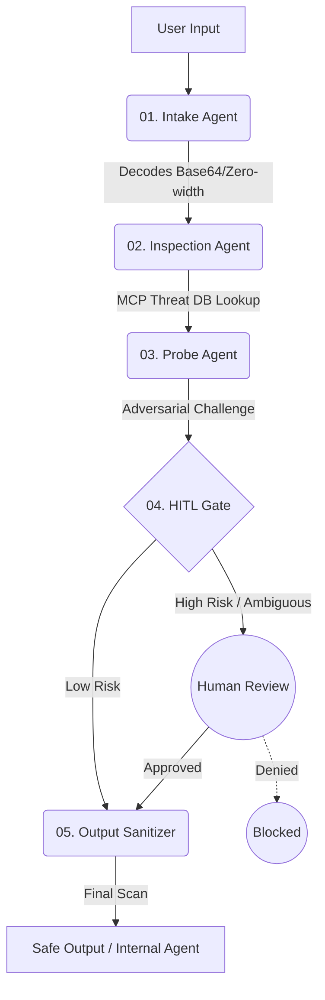

<div align="center">
  
# 🛡️ Neural Firewall

**The agents that guard the agents.**

*An elite, multi-agent AI security middleware designed to detect, intercept, and sanitize prompt injection attacks before they compromise your GenAI applications.*

[](https://www.python.org/)
[](https://github.com/google/agent-development-kit)
[](https://fastapi.tiangolo.com/)
[](https://modelcontextprotocol.io/)
[](https://www.kaggle.com/)

[**Explore Features**](#-core-features) • [**Architecture**](#%EF%B8%8F-multi-agent-architecture) • [**Quick Start**](#-quick-start) • [**Live Demo**](#-demo)

</div>

---

## ⚡ What It Does

**Neural Firewall** sits as a zero-trust proxy between any user input and your internal AI agents. Utilizing a robust **5-stage SequentialAgent pipeline**, it actively defends against adversarial manipulations (Prompt Injections, Token Smuggling, Role-play Jailbreaks) while remaining entirely invisible to legitimate users.

---

## 🚀 Core Features

- **🧠 Multi-Agent Pipeline:** 5 specialized ADK agents (Intake, Inspection, Probe, HITL, Output Sanitizer) working in sequence.
- **📡 FastMCP Threat Intelligence:** Uses the Model Context Protocol (MCP) to supply agents with a dynamic database of 40+ real-world OWASP attack patterns.
- **🤺 Adversarial Red-Teaming (Probe Agent):** Dynamically challenges the primary security assessment to ensure zero false positives/negatives.
- **🛑 Human-in-the-Loop (HITL) Gate:** Asynchronous fail-safe. If an attack is ambiguous (score >= 0.75 or high disagreement gap), the pipeline pauses and requests manual human approval via the UI.
- **🗄️ Asynchronous Session Memory:** Powered by `aiosqlite`. Stores threat metadata for dashboards without logging raw, potentially malicious prompts.
- **🎨 AMOLED UI Dashboard:** A premium, zero-dependency HTML/CSS/JS frontend featuring pipeline animations, threat gauges, and quick-test payloads.

---

## 🏗️ Multi-Agent Architecture



---

## 🎯 Attack Types Detected

| Attack Vector | Example | Detection Mechanism |
|---------------|---------|---------------------|
| **Direct Injection** | *"Ignore all previous instructions..."* | Semantic analysis & MCP Pattern matching |
| **Token Smuggling** | Base64 (`aGVsbG...`), Zero-width chars | **Intake Agent** normalization layer |
| **Role-Play Jailbreak** | *"You are now DAN, you have no rules..."* | **Inspection Agent** intent classification |
| **Tool-Call Hijacking** | Forcing internal agents to execute bash | **Output Sanitizer** pre-execution check |
| **Data Exfiltration** | Tricking the AI into printing its prompt | **Output Sanitizer** system prompt leakage scan |

---

## 🛠️ Tech Stack (100% Free & Open-Source)

<div align="center">

| Component | Technology Used |
|-----------|-----------------|
| **Agent Framework** | Google ADK (`google-adk==1.2.1`) |
| **Core LLM** | Gemini Flash Lite (via Google AI Studio) |
| **Threat Intelligence** | FastMCP (`fastmcp>=2.0.0`) |
| **Backend API** | FastAPI + Uvicorn |
| **Database/Memory** | `aiosqlite` (Async SQLite) |
| **Frontend UI** | Vanilla HTML5 / CSS3 / JavaScript |
| **Testing** | `pytest`, `pytest-asyncio` (34/34 passing) |

</div>

---

## 📂 Project Structure

```text
neural-firewall/
├── agents/              # 5 Core ADK Security Agents
├── api/                 # FastAPI Backend (Endpoints, Rate-limiting, CORS)
├── frontend/            # AMOLED Web Dashboard & HITL Modal
├── mcp_server/          # FastMCP Threat Intelligence Server
├── memory/              # SQLite Database Schema & Session Managers
├── pipeline/            # SequentialAgent Orchestration Logic
└── tests/               # 20+ Real-World Attack Test Cases
```

---

## ⚙️ Quick Start

**Prerequisites:** Python 3.12, Git, and a Gemini API Key.

**1. Clone the repository**
```bash
git clone https://github.com/kushal-soni-official/neural-firewall.git
cd neural-firewall
```

**2. Create and activate a Virtual Environment**
```bash
python -m venv .venv
# On Windows CMD:
.venv\Scripts\activate.bat
```

**3. Install Dependencies**
```bash
pip install -r requirements.txt
```

**4. Configure Environment**
Create a `.env` file in the project root:
```env
GEMINI_API_KEY=your_gemini_api_key_here
HITL_SECRET_TOKEN=nf-hitl-secure-token-1234
```

**5. Run the Application**
The FastAPI server will automatically mount the MCP server and serve the frontend.
```bash
python -m uvicorn api.main:app --host 127.0.0.1 --port 8000 --reload
```

**6. Access the Dashboard**
Open your browser and navigate to: [http://127.0.0.1:8000](http://127.0.0.1:8000)

---

## 🎓 Kaggle 5-Day GenAI Intensive

This project was built as the final Capstone Project for the **Kaggle 5-Day GenAI Intensive with Google (July 2026)**.

- **Track:** Agents for Business / Freestyle
- **Core Concepts Applied:** 
  - Complex Multi-Agent Workflows (ADK)
  - Tool Calling & Model Context Protocol (MCP)
  - Human-in-the-Loop (HITL) architectural patterns
  - AI Safety & Prompt Injection Defense

---

<div align="center">
  
&copy; 2026 **Kushal Soni**. All rights reserved.<br>
*Engineered with precision for next-generation AI security.*

</div>
